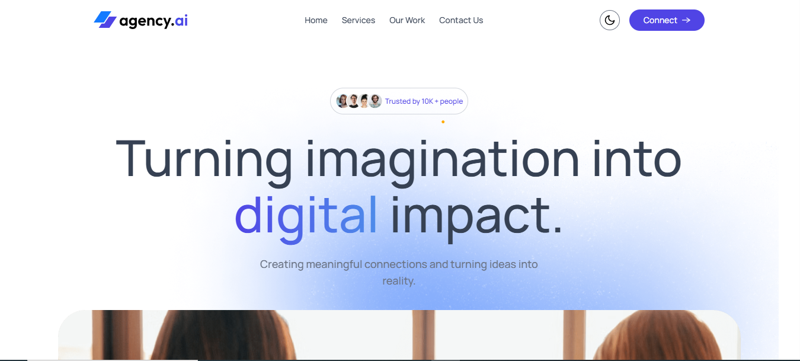
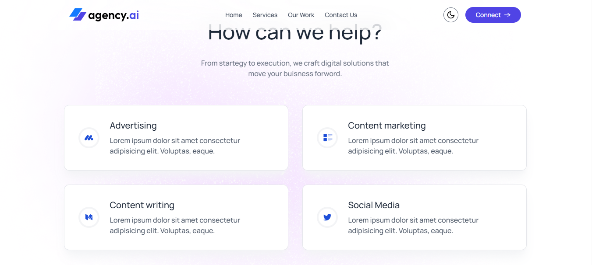
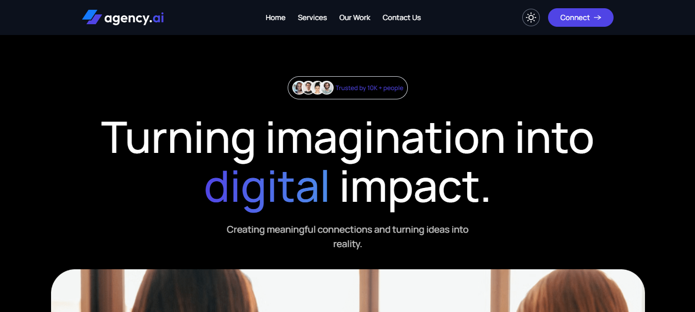
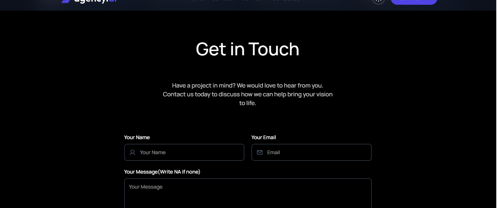

# 🚀 Agency.AI — Digital Agency Landing Page

A sleek, fully responsive digital agency landing page built with **React 19**, **Vite**, and **Tailwind CSS v4** — featuring scroll-triggered animations, dark/light theme toggle, and a working contact form.

---

## 🔗 Live Demo

👉 [**View Live**](https://agency-ai-one-mu.vercel.app/)

<!-- Replace the URL above with your actual Vercel deployment link -->

---

## 📸 Screenshots

### 🌞 Light Mode




### 🌙 Dark Mode




---

## ✨ Features

- 🎨 **Dark / Light Theme** — Seamless toggle with state persisted in `localStorage`
- 🎬 **Scroll Animations** — Smooth entrance effects using Motion (Framer Motion)
- 📱 **Fully Responsive** — Mobile-first design with hamburger navigation on small screens
- 📩 **Working Contact Form** — Powered by Web3Forms with real-time toast notifications
- 🏢 **Trusted By Section** — Brand logo showcase (Google, Airbnb, Zoom, Microsoft, etc.)
- 🛠️ **Services Grid** — Animated service cards for Advertising, Content Marketing, Writing & Social Media
- 💼 **Portfolio Showcase** — "Our Work" section with project previews
- 👥 **Team Section** — Meet the team display
- 🧭 **Smooth Scroll Navigation** — Anchor-based section jumping with CSS `scroll-smooth`
- 🔝 **Sticky Navbar** — Glassmorphism navbar with backdrop blur

---

## 🛠️ Tech Stack

| Technology | Purpose |
|---|---|
|  | UI components |
|  | Build tool & dev server |
|  | Utility-first styling |
|  | Scroll-triggered animations |
|  | Contact form backend |

---

## 🧑‍💻 Installation

1. **Clone the repository**

   ```bash
   git clone https://github.com/Raushan1504/Agency-AI.git
   cd Agency-AI
   ```

2. **Install dependencies**

   ```bash
   npm install
   ```

3. **Start the dev server**

   ```bash
   npm run dev
   ```

4. **Open** `http://localhost:5173` in your browser.

### Other Commands

```bash
npm run build     # Build for production
npm run preview   # Preview production build
npm run lint      # Run ESLint
```

---

## 🔐 Environment Variables

To run this project, add the following environment variable to a `.env` file in the project root:

```env
VITE_WEB3FORMS_KEY=your_web3forms_access_key
```

| Variable | Description | Required |
|---|---|---|
| `VITE_WEB3FORMS_KEY` | Your [Web3Forms](https://web3forms.com/) access key for the contact form | Yes |

> Get your free access key at [web3forms.com](https://web3forms.com/)

Then update `src/components/ContactUs.jsx`:

```js
formData.append('access_key', import.meta.env.VITE_WEB3FORMS_KEY)
```

If deploying to **Vercel**, add the variable in **Settings → Environment Variables**.

---

## 🧠 What I Learned

Building Agency.AI taught me several key concepts:

- **Tailwind CSS v4** — Worked with the latest version including `@theme` directives for custom design tokens, `@custom-variant` for dark mode, and the new `@tailwindcss/vite` plugin integration.
- **Framer Motion (Motion)** — Implemented `whileInView` scroll-triggered animations with staggered children, giving the page a polished, professional feel without heavy JS.
- **Dark Mode Architecture** — Built a theme system that toggles a `.dark` class on `<html>`, persists user preference in `localStorage`, and uses Tailwind's `dark:` variant throughout the entire UI.
- **Web3Forms Integration** — Set up a serverless contact form that works without a backend — handling loading states, success/error toasts, and form resets.
- **Responsive Navigation** — Created a mobile sidebar that overlays on small screens and collapses into the inline navbar on larger breakpoints using Tailwind's responsive utilities.
- **Vite Build Pipeline** — Gained experience with Vite 8's fast HMR, plugin ecosystem, and production build optimizations for deployment on Vercel.

---

## 📄 License

This project is licensed under the [MIT License](LICENSE).

---

<p align="center">Built with ❤️ by <a href="https://github.com/Raushan1504">Raushan</a></p>

